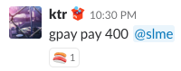
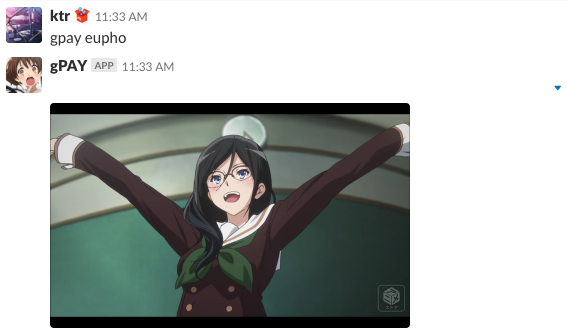

gPAY: a Payment Application for You
====

[](https://circleci.com/gh/GoodCodingFriends/gpay/tree/master)  

  
  


Please set these envvars.
```
Environment = "REPOSITORY_MYSQL_NET=unix"
Environment = "REPOSITORY_MYSQL_ADDRESS=/var/run/mysqld/mysqld.sock"
Environment = "CONTROLLER_SLACK_APITOKEN="
Environment = "CONTROLLER_SLACK_VERIFICATIONTOKEN="
```
